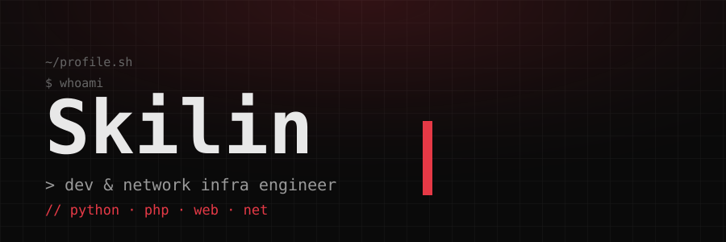

  

  <samp>
    <b>// dev &amp; network infra</b> — Arch Linux, Hyprland, self-hosted. 
    Пишу GUI на PySide6, веб на PHP/SQLite, управляю сетями на zapret / sing-box / xray.
  </samp>

---

### // stack

  
  
  
  
  
  
  
  
  

  
  
  
  
  
  
  
  
  
  
  

---

### // projects

<table align="center">
  <tr>
    <td width="50%" valign="top">
      <samp>
        <b>zapret-GUI</b> &nbsp; 
        Linux &middot; PySide6 
        Обход замедления YouTube/Discord через zapret. Статус, метрики, вкл/выкл одной кнопкой.
      </samp>
    </td>
    <td width="50%" valign="top">
      <samp>
        <b>zapret-GUI-Windows</b> &nbsp; 
        Windows &middot; PySide6 + WinDivert 
        Тот же GUI, обёртка над winws. Работает без прав администратора на постоянной основе.
      </samp>
    </td>
  </tr>
</table>

  <samp>
    <b>tuf-gateway</b> приватный &middot; ASUS TUF-AX3000 V2 / Asuswrt-Merlin 
    VPN-шлюз на роутере: sing-box tproxy, заблокированное — через xray, остальное — напрямую.
  </samp>

  <samp>
    <b>TGBOT</b> приватный &middot; aiogram 3 — модульный Telegram-бот с whitelist и защитой диска. 
    <b>InIProject</b> — сайт команды <code>// iniproject.ru</code>.
  </samp>

---

### // stats

  

  

  

---

  <samp>
    <code>const goals = [] // todo: add sleep</code> 
    <code>while (true) { code(); game(); }</code>
  </samp>

  <samp>
    <code>&gt; echo "спасибо, что заглянул"</code>
  </samp>

