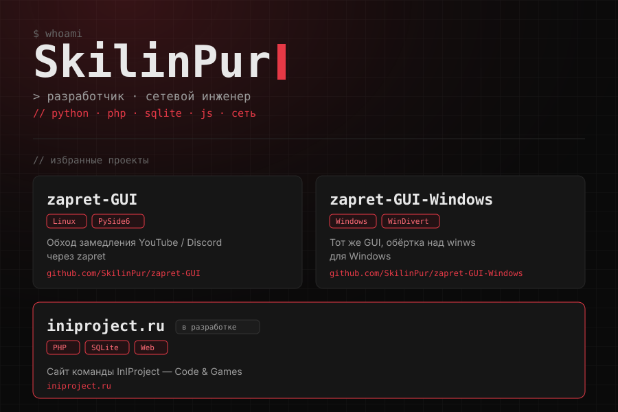

<p align="center">
  
</p>

<p align="center">
  <samp>Arch Linux · Hyprland · self-hosted</samp>
</p>

---

## // stack

<p align="center">
  
  
  
  
  
  
  
  
  
</p>

<p align="center">
  
  
  
  
  
  
  
  
  
  
  
</p>

---

## // projects

```text
$ ls ~/projects
zapret-GUI           GUI для zapret на Linux (обход замедления YouTube/Discord)   [public]
zapret-GUI-Windows   то же самое для Windows, обёртка над winws                   [public]
tuf-gateway          VPN-шлюз на ASUS TUF-AX3000 V2 (sing-box tproxy)             [private]
TGBOT                приватный Telegram-бот на aiogram 3, модульный              [private]
iniproject.ru        сайт команды InIProject                                      [public]
```

**Открытое:**
- [zapret-GUI](https://github.com/SkilinPur/zapret-GUI) — Linux, PySide6
- [zapret-GUI-Windows](https://github.com/SkilinPur/zapret-GUI-Windows) — Windows, PySide6 + WinDivert

---

## // stats

<p align="center">
  
</p>

<p align="center">
  
</p>

<p align="center">
  
</p>

<p align="center">
  
</p>

---

<p align="center">
  <samp>
    <code>const goals = [] // todo: add sleep</code><br>
    <code>while (true) { code(); game(); }</code><br><br>
    <sub><code>&gt; echo "спасибо, что заглянул"</code></sub>
  </samp>
</p>
